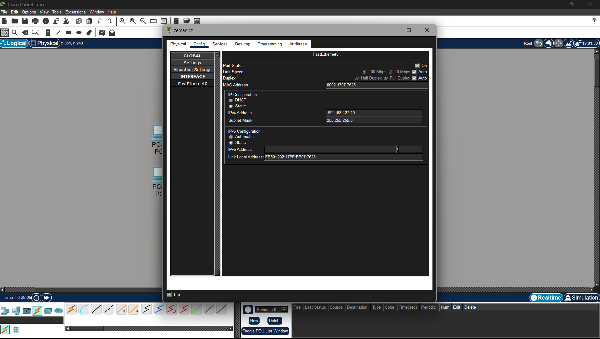
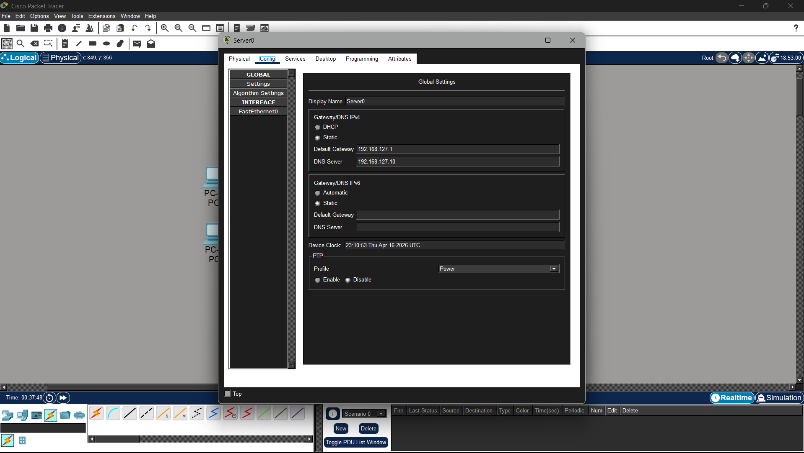
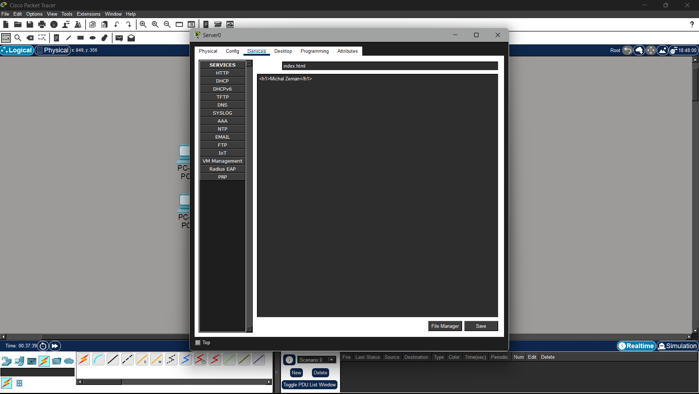
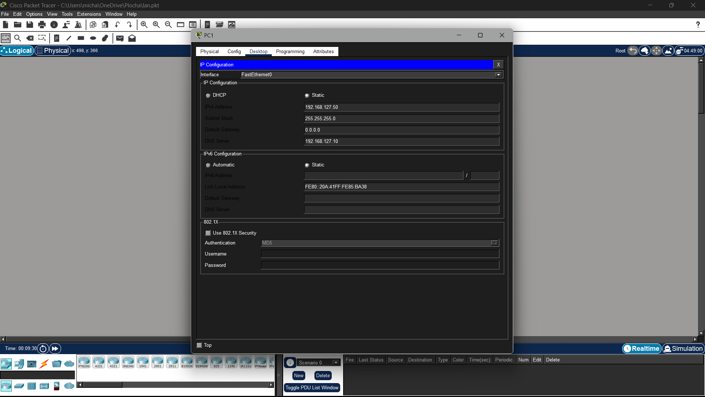
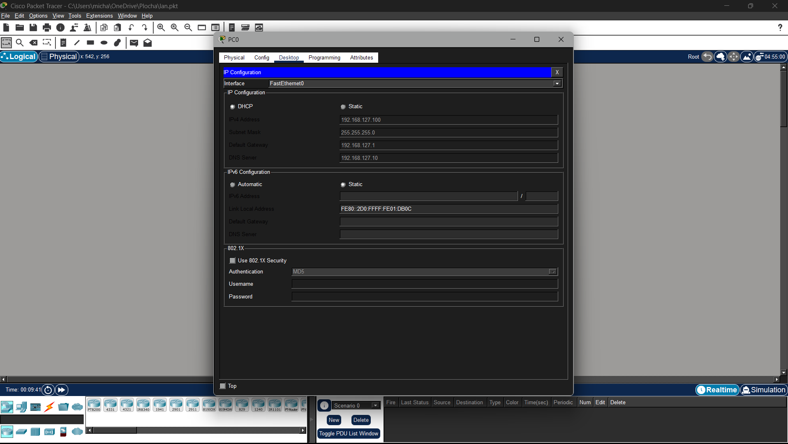
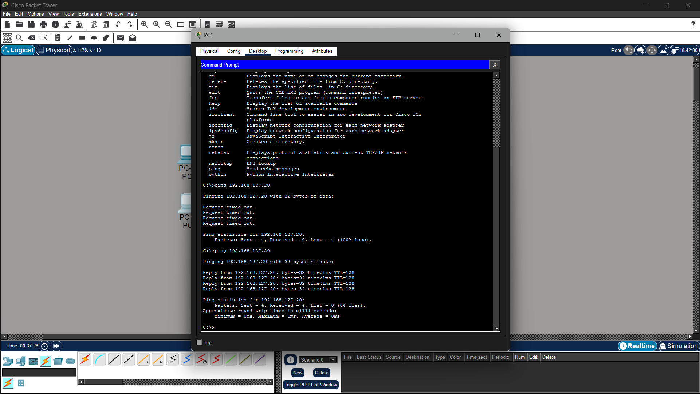
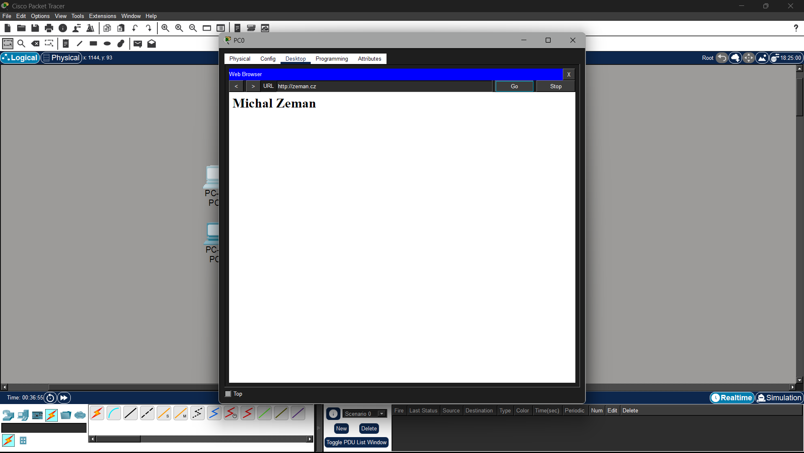

# Projekt LAN v Cisco Packet Tracer

Model lokální sítě (LAN) se dvěma switchi, klientskými stanicemi a servery (DHCP, DNS, WEB).

## 1. Výpočet parametru X
- **Příjmení:** [DOPLŇ SVÉ PŘÍJMENÍ]
- **Výpočet:** (Součet ASCII hodnot velkými písmeny) mod 256
- **Výsledné X:** [DOPLŇ SVÉ X]
- **Přiřazený rozsah:** 192.168.X.0 / 24

## 2. Popis sítě
- **S1:** Připojuje PC1 (statická IP) a PC2 (DHCP).
- **S2:** Připojuje SRV1 (DHCP + DNS) a SRV2 (WEB).
- **Propojení:** Switche jsou propojeny kříženým kabelem. Konfigurace proběhla přes konzoli z Laptopu.

## 3. Dokumentace (Snímky obrazovky)

### Laptop - Konfigurace Switchů
Nastavování základních parametrů switchů přes terminál.

### Nastavení serverových služeb (SRV1 a SRV2)
Konfigurace DHCP poolu a DNS záznamů pro doménu.

### PC1 a PC2 - IP Konfigurace
Ověření přidělených adres (staticky i z DHCP).

### Testování konektivity a služeb
Ping na webový server a zobrazení stránky přes doménové jméno.

